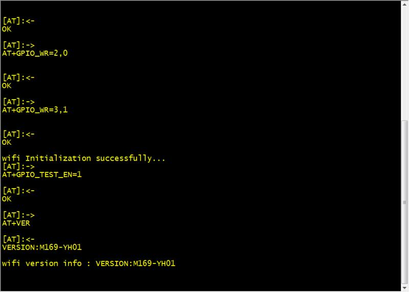

# AT Command

## 介绍
一种AT命令通信解析模块,支持裸机(at_chat)和OS版本(at)。适用于modem、WIFI模块、蓝牙通信。

## 软件架构

- at_chat.c at_chat.h list.h

用于无OS版本，使用链式队列及异步回调方式处理AT命令收发，支持URC处理、自定义命令发送与解析作业。
- at.c at.h at_util.h 

用于OS版本, 使用前需要根据at_util.h规定的操作系统相关的接口进行移植,如提供信号量操作、任务延时等操作。


## 使用说明

### at_chat 模块(无OS)


##### 基本概念

at_chat 模块使用链式队列进行管理，包含2条链表，空闲链表和就绪链表。它们的每一个基本工作单元称为一个作业项，对于将要执行的命令都会放到就绪链表中，命令执行完成之后由空闲链表来进行回收，作业项的定义如下：

```

/*AT作业项*/
typedef struct {
    unsigned int  state : 3;
    unsigned int  type  : 3;                                 /* 作业类型*/
    unsigned int  abort : 1; 
    void          *param;                                    /* 通用参数*/
	void          *info;                                     /* 通用信息指针*/
    struct list_head node;                                   /* 链表结点*/
}at_item_t;

```

作业是AT控制器定义时固定分配的，没有使用动态内存，默认支持10个作业项，即同时可以允许10个AT命令排队等待处理。

/*...未完，待续*/

##### 基本接口与描述
- at_send_singlline, 发送单行命令，默认等待OK响应，超时3S
- at_send_multiline, 多行命令，默认等待OK响应，超时3S
- at_do_cmd，支持自定义发送格式与接收匹配串
- at_do_work，支持自定义发送与接收解析

##### 使用演示

详细使用可以参考Demo程序wifi_task.c模块


```

/* 
 * @brief   定义AT控制器
 */
static at_obj_t at;

const at_adapter_t adap = {  //AT适配器接口
	//适配GPRS模块的串口读写接口
	.write       = uart_write,
	.read        = uart_read
	...
};

```


3.  初始化AT控制器

```

at_obj_init(&at, &adap);

```


4.  将AT控制器放入任务中轮询（考虑到处理实时性，建议20ms以下）

```
/* 
 * @brief    wifi任务(10ms 轮询1次)
 */
void wifi_task(void)
{
    at_poll_task(&at);
}task_register("wifi", wifi_task, 10);

```


5.  发送单行命令

**例子：**

=> AT+GPIO_TEST_EN=1\r\n

<= OK\r\n

```

/**
 * @brief AT执行回调处理程序
 */
static void test_gpio_callback(at_response_t *r)
{
	if (r->ret == AT_RET_OK ) {
	    printf("Execute successfully\r\n");
	} else {
	    printf("Execute failure\r\n");
	}
}
at_send_singlline(&at, test_gpio_callback, "AT+GPIO_TEST_EN=1");
```


#### at 模块(OS版本)

由于AT命令通信是一个比较复杂的过程，对于没有OS的环境下处理难度比较大，也很绕,对于不允许阻塞程序，除了使用状态与+回调没有其它更好的办法，所以推荐使用这个模块

##### 基本接口与描述

- at_do_cmd，执行AT命令，可以通过这个接口进一步封装出一常用的单行命令、多行命令。
- at_split_respond_lines，命令响应分割器。
- at_do_work，如果发送的数据比较复杂，如GPRS模组发送短信或者发送socket数据需要等待"<"提示符，可以通过这个接口自定义收发。

##### 使用演示(后续会提供一个无线GPRS模块演示程序出来)
```

static at_obj_t at;          //定义AT控制器

static char urc_buf[128];    //URC主动上报缓冲区

utc_item_t utc_tbl[] = {     //定义URC表
	"+CSQ: ", csq_updated_handler
}

const at_adapter_t adap = {  //AT适配器接口
	.urc_buf     = urc_buf,
	.urc_bufsize = sizeof(urc_buf),
	.utc_tbl     = utc_tbl,
	.urc_tbl_count = sizeof(utc_tbl) / sizeof(utc_item_t),	
	
	//适配GPRS模块的串口读写接口
	.write       = uart_write,
	.read        = uart_read
};

```

3.  初始化AT控制器并创建AT线程

```

void at_thread(void)
{
	at_obj_create(&at, &adap);
    while (1) {        
        at_thread(&at);
    }
}

```


4.  使用例子
查询GPRS模块信号质量：
	=> AT+CSQ
	
	<= +CSQ: 24, 0
	<= OK
	
```
/* 
 * @brief    获取csq值
 */ 
bool read_csq_value(at_obj_t *at, int *rssi, int *error_rate)
{
	//接收缓冲区
	unsigned char recvbuf[32];
	//AT响应
	at_respond_t r = {"OK", recvbuf, sizeof(recvbuf), 3000};
	//
	if (at_do_cmd(at, &r, "AT+CSQ") != AT_RET_OK)
		return false;
	//提取出响应数据
	return (sscanf(recv, "%*[^+]+CSQ: %d,%d", rssi, error_rate) == 2);

}


```
